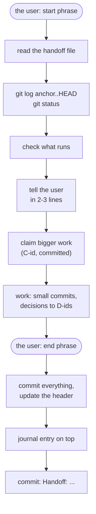
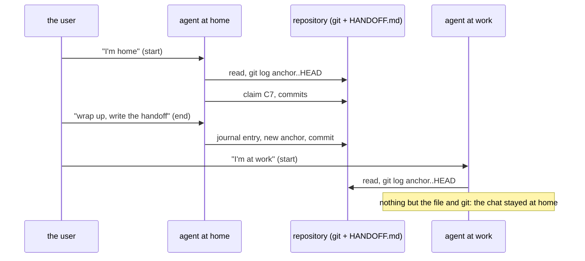

# Rada · anchor/1

A handoff protocol for AI coding agents that take turns on one repository and
do not remember each other.

*Русская версия: [README.ru.md](README.ru.md).*

| | |
|---|---|
| Version | `rada-anchor/1` |
| Origin | devised while building [QLadder](https://qladder.com), a ladder and lobby server for Cossacks 3 |
| Scope | any project: several agents, or one agent in several sessions, on one repository |
| Templates | [template/HANDOFF.md](template/HANDOFF.md), [template/agent-instructions.md](template/agent-instructions.md) |

## Why

QLadder was built by several Claude Code sessions, started from the user's
different computers (home, work) but all working on the same server and
repository. None of them remembered what the others did. Chat history stays
in the session that had it; an agent's private memory is not shared either.

What every session does share is **the repository**. The protocol puts the
handoff there:

- a **handoff file** in the repository, `HANDOFF.md` by default;
- the **git history**, which the handoff file points into.

The protocol is not about QLadder. It works wherever agents take turns on a
repository: different machines, different sessions, different models, or a
person joining in.

## The name

Two halves, as the work has two sides.

- **Rada** (рада, the Cossack council whose word stands) is the human half:
  the user steers the protocol with two phrases, and the user's decisions
  are written down once and not asked again.
- **anchor/1** is the machines' half: an anchor commit, a machine-readable
  header, stable ids and an entry template. The number is the version of the
  rules; whoever changes the rules raises it and says what changed.

**The principle:** the next reader diffs from the anchor and trusts nothing
it cannot check in git.

## How a shift goes





## The user's side

The user picks two phrases and puts them into the agents' instructions:

- a **start phrase**: start a shift (QLadder: «я дома» / «я на работе», or a
  greeting). A session left open while the user worked elsewhere starts a
  shift again when the user comes back: another agent may have worked in
  between.
- an **end phrase**: end the shift (QLadder: «закругляемся, пиши handoff»).

## The handoff file

### Header

A YAML block at the top, for a quick machine read:

```yaml
protocol: rada-anchor/1
state_as_of: 2026-09-28 19:01 CEST
anchor_commit: c17112a        # everything newer is not described here yet: git log --oneline c17112a..HEAD
live:                         # what runs or is deployed, and from which commit
  web: working tree at the last restart
  server: release @ 1a908d0
tests: 76 passed, 1 skipped
claims: []                    # ids from "In progress"
open: [O11, O12, O14]
notes: []
decisions: [D1, D2, D3]
```

Add what matters to the project (QLadder keeps its analyzer's version).

### Ids

Stable, never reused, referred to in entries and commit messages
("closes O4").

| Id | What | Where | Ends as |
|---|---|---|---|
| `C<n>` | a claim: "I am working on this" | In progress | removed when done |
| `O<n>` | an open task | Open | struck out: `~~O1~~ done <date> <commit>` |
| `D<n>` | the user's decision | Decisions | stays |
| `N<n>` | a note to the next agent | Notes for the next instance | removed by the agent that handles it, who says so in the journal |

### Sections

`Protocol`, `In progress`, `Notes for the next instance`, `Current state`,
`Open`, `Decisions`, `Journal` (newest entry first). A ready file:
[template/HANDOFF.md](template/HANDOFF.md).

## The rules

### 1. Start of a shift

1. Read the header, then "In progress", "Notes for the next instance",
   "Current state", "Open", "Decisions", and the journal entries since your
   last shift (the last three if this is your first).
2. See what happened in git:
   - `git log --oneline <anchor_commit>..HEAD`: commits newer than the file.
     Anything there that the journal does not mention was not handed over:
     read those commit messages.
   - `git status --short` for uncommitted work.
3. Uncommitted changes you did not make may belong to an agent that is still
   running. Do not edit, stash, reset or commit them: ask the user whether
   that session is still active.
4. Check what runs (services, deployments). A deploy may be missing: compare
   the journal's "Deployed" lines with git.
5. Tell the user in two or three lines what you found (the last entry, the
   claims, the notes) before starting new work.

### 2. Claim what you work on

Before anything bigger than a quick fix, add a line to "In progress" and
commit it:

    - C<n>: <what> (O<k> if it is an Open item) — <machine or place>, since <YYYY-MM-DD HH:MM>

Another agent that sees the claim leaves that area alone, or asks the user.
Remove your line when done. A claim older than a day with no commits is
stale: ask the user, then take it over.

### 3. During the shift

- Commit early and often, in small commits. The commit message is the
  detailed log; the journal only sums it up.
- Before deploying, restarting services or migrating data, look at
  "In progress" and `git status`: another agent may be in the middle of
  something.
- The user's decisions go to "Decisions" at once, so nobody asks again.
- An agent's private memory must not be the only record. What another agent
  needs goes into the handoff file.

### 4. End of a shift

Before you stop, or when the user says the end phrase:

1. Commit or deliberately leave your work. Uncommitted changes you leave:
   list the files and why in your entry.
2. Update the header (`anchor_commit` = `git rev-parse --short HEAD` before
   the handoff commit; `live`; `tests`), "Current state", "Open",
   "Decisions", and your lines in "In progress".
3. Add a journal entry **on top**:

   ```
   ### YYYY-MM-DD HH:MM — <machine or place>, <model>
   - Done: <what and why, with commit hashes>
   - Verified: <tests: N passed; what was checked by hand>
   - Deployed: <yes / no / partly: what runs and what is only committed>
   - Ids: <opened O5 / closed O1 / added D6 / handled N1>
   - Half-done: <what, where, the next step>
   - For the user: <what the user should do or answer, if anything>
   ```

4. Commit the file: `git commit -m "Handoff: <one line>"`, and confirm to the
   user in one line.

### 5. Notes to the next agent

A line under "Notes for the next instance" passes on what does not fit the
journal: a warning, a request, a thing to check. The agent that handles a
note deletes it and says so in its entry.

### 6. Two sessions at the same time

- Git is the arbiter. Commit only your own files (`git add <paths>`), never
  `git add -A` or `git commit -a` while someone else may have changes.
- If `git status` shows changes in files you are editing, stop and ask.
- A restart can break the other agent's check: say it in a note if you do one.

## Adopting it

1. Copy [template/HANDOFF.md](template/HANDOFF.md) to the repository's root
   and commit it.
2. Put [template/agent-instructions.md](template/agent-instructions.md) into
   the instructions every agent loads (for Claude Code: the user's
   `~/.claude/CLAUDE.md`, or the project's `CLAUDE.md`), with your two
   phrases.
3. Keep a project guide next to it (layout, how to build, test and deploy,
   rules): the handoff file says what changed, the guide says how things
   are.

## Changing the rules

The rules live in the handoff file's "Protocol" section, so every agent
reads the current ones. Change them there, raise the version in the header
(`rada-anchor/2`), and say what changed in your journal entry.

## License

MIT, see [LICENSE](LICENSE).
