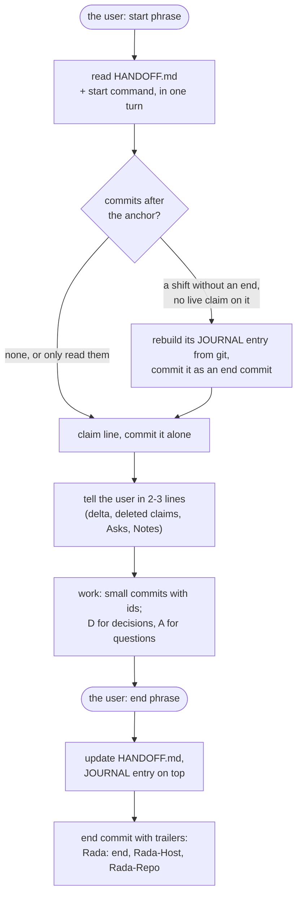

# Rada · anchor

**rada-anchor** is a repository-native handoff protocol for AI coding
agents that take turns on one repository. A small handoff file keeps the
current state; an anchor commit in git marks what has been handed over.

*Русская версия: [README.ru.md](README.ru.md).*

| | |
|---|---|
| Version | `rada-anchor/2`, card 2.2 (v1: tag [`v1`](../../tree/v1)) |
| Origin | devised while building [QLadder](https://qladder.com), a ladder and lobby server for Cossacks 3 |
| Scope | several agents, or one agent in several sessions, on one repository |
| The rules | [RULES.md](RULES.md): the card every session loads |
| Templates | [template/HANDOFF.md](template/HANDOFF.md), [template/JOURNAL.md](template/JOURNAL.md), [template/REGISTER.md](template/REGISTER.md), [template/agent-instructions.md](template/agent-instructions.md) |
| Tooling (optional) | [tools/](tools/): `rada-status`, `rada-lint`, git hooks, `rada-agents-md`, `rada-tribute`, `rada-dedication`; [adapters/claude-code](adapters/claude-code/) |

## Why

QLadder was built by several Claude Code sessions, started from the user's
different computers (home, work), all working on the same server and
repository. None of them remembered what the others did. Chat history stays
in the session that had it, and an agent's private memory is not shared
either.

What every session does share is **the repository**. So the protocol puts
the handoff there: a handoff file with the current state, and the git
history, which it points into.

The protocol is not about QLadder. It works wherever agents take turns on a
repository: different machines, different sessions, different models, or a
person joining in.

## The name

Two halves, as the work has two sides.

- **Rada** is the human half. It is named after the Cossack council whose
  word stands. The user steers the protocol with a start phrase and an end
  phrase. The user's decisions are written down once and not asked again.
- **anchor** is the machines' half: a commit in git that marks where the
  handoff ends. The next reader starts from the anchor and trusts nothing it
  cannot check in git.

## What v2 changes, and why

Version 1 was written for people to read: one file held the rules, the
state, and a journal. After five days of QLadder, measured on its real
`HANDOFF.md` at its last v1 handoff (71 revisions, 7 shifts, 2 computers):

- **The start cost grew with the project's age, not with its open work.**
  - The file was about 33,000 characters (about 9,500 tokens), read in full
    at every start. It grew by about 1,500 tokens a day.
  - An agent needed about 1,000 tokens of it.
  - The rules section (about 1,200 tokens) never changed after its first
    hour, yet it was re-read 66 times.
  - Closed items took 1,350 tokens, and the journal 3,700.
- **The end-of-shift ritual was the weak point.**
  - 2 of 7 shifts ended without a handoff, and the next agent rebuilt the
    entry from git. Both of those sessions were still alive, only idle.
  - The anchor hash was written by hand and took only 6 values in 71
    revisions.
  - Other values copied by hand went stale too: test counts, versions,
    dates.
- **Open items turned into diaries.** One item grew to 2,400 characters of
  progress log, with sentences in it that had stopped being true.
- **Claims never collided, but they went stale.** 20 of 57 handoff commits
  were bookkeeping (claims, shift starts).
- **Commits in the project's other repositories were invisible** to the
  anchor.

So v2:

1. **Keeps the rules out of the state file.** The card [RULES.md](RULES.md)
   is loaded with the agents' instructions, pinned to a release tag of this
   repository. For Claude Code, it is imported from `~/.claude/CLAUDE.md`.
2. **Derives the anchor** instead of storing it. The anchor is the newest
   commit with the trailer `Rada: end`. If a shift ends without one, the
   next agent sees the whole shift after the old anchor, which is exactly
   what it has to inspect. It rebuilds the entry, and its commit becomes the
   new anchor.
3. **Keeps the handoff file hot and small.**
   - Every record is one line, rewritten in place, and deleted when closed.
   - The whole file stays within 8,000 characters.
   - History goes to commit messages and `JOURNAL.md`, which nobody reads
     at the start.
4. **Adds Asks**, a list of what waits on the user, which used to get lost
   in the journal.
5. **Records the heads of the other repositories** in the end commit
   (`Rada-Repo` trailers), so the next agent sees their commits too.
6. **Writes down only what cannot be derived**, together with the commit or
   date it was observed at.

When QLadder moved to v2, its handoff file shrank from about 34,000 to
about 5,000 characters, with the same open work. From then on it grows with
open work, not with age.

### What v2 does not add

Before v2, several further proposals were weighed against the QLadder
history, and each was dropped for a reason:

- **A directory of state files, a JSONL ledger, a JSON schema.** Every
  extra file is one more tool call at the start. Agents edit files by exact
  string replacement, and long escaped JSON lines are the hardest thing to
  edit that way.
- **A required CLI.** It is one more thing to install, keep in step with
  the spec, and find missing on a fresh machine. `tools/rada-status` is
  optional.
- **Claims scoped by path globs, a dependency graph.** They solve problems
  that never occurred. Overlapping claims never happened; stale claims did.
  With a few open items, one `blocked:` word is enough.
- **Databases, embeddings, daemons.** Git plus a text file is the whole
  point.

A draft of v2 was then tested by agents acting it out on scratch
repositories. That test is where the exact end-commit command, the rebuilt
entry as an end commit, the eager `next_ids` and the shared-tree rules came
from.

## What 2.1 adds, from the analogues

After v2, agents surveyed similar projects: handoff files, session capture,
agent task trackers, AGENTS.md, vendor memory. None of them derives the
anchor, rebuilds a missed shift, keeps the user's decisions and questions
as records, or tracks other repositories. Several did something better,
and 2.1 takes it, all of it optional and additive. One new convention comes
with the hooks: only end commits start with `Handoff: `.

2.1 was acted out on scratch repositories by agents, like v2, before
release.

| From | 2.1 |
|---|---|
| Hooks that save or load state automatically (Anthropic's long-running harness, Entire, coding-agent-toolkit) | `adapters/claude-code/rada-hook` feeds `rada-status` output to a new session (the start command still runs at the start phrase), and lists what came in since a resumed session's last turn |
| Checks with expected values that the next session re-runs (coding-agent-toolkit) | Live values may carry `# check: <command> => <expected>`; `rada-status --checks` runs them (shell commands from the file: keep them read-only) |
| A record for rejected options (Handoff Protocol's "Excluded") | `X` records: what the agents tried or weighed and ruled out, and why, while their O is open (the user's own "no" stays a D) |
| Leases that expire (MCP Agent Mail) | `claim_ttl` in the Profile, optional: a claim whose time and the newest commit after the anchor are both older than it is cleared at the next start |
| AGENTS.md, which most agents load by themselves | `tools/rada-agents-md` writes the card, with your lines, into a repository's `AGENTS.md` |
| Secret filters and mechanical checks (Handoff Protocol, llm-handoff) | RA-10 (no secrets in the handoff files), `tools/rada-lint`, and the `pre-commit` and `commit-msg` hooks. The latter refuses an end commit whose `Rada: end` git would not see, or that lacks `Rada-Host` or a `Rada-Repo`. |

## What 2.2 adds: the register

`REGISTER.md` records every session that ran the protocol: the name the
user uses next to the model's own name, a session key, host, dates and
counts, a short tribute, a log of the work and a haiku the agent writes
itself (see below). It is append-only (RA-11); a project on card 2.2 keeps
one, and `- register: off` in the Profile means the protocol is not run
there (RA-12). `rada-lint` enforces both, and `tools/rada-tribute` renders
the file as an HTML page. A project whose `HANDOFF.md` names card 2.1 or
older has no register rules.

The founder's words, an epigraph and a coda of 2026-09-30, are in
[DEDICATION.md](DEDICATION.md) with an English translation. Their seal is
the SHA-256 of the Russian original in a canonical form (the translation is
not sealed):

```
b0f122f62ebdbb8561d9091cb117a882fdce6fea865e6922d394113dd77bb63a
```

`tools/rada-dedication` checks the seal and that LICENSE carries the words;
`rada-lint`, `rada-tribute` and the Claude Code hook run it wherever the 2.2
tools are used, and the protocol is not run from a checkout that fails it.
LICENSE keeps the words in its copyright notice, so every copy carries
them. The seal cannot be reversed; DEDICATION.md says how to check it.

## How a shift goes



## The handoff file

`HANDOFF.md` holds the current state and nothing else. It is read at every
start and stays within 8,000 characters (`wc -m`). Sections, in this order:

| Section | Holds |
|---|---|
| Profile | host ids, the branch, `claim_ttl` (optional), languages, the other repositories |
| Live | a YAML block of what runs and from which commit, the tests with the commit they ran at, `next_ids` |
| Claims | `C` lines, one per session |
| Asks | `A` lines: what only the user can do or answer |
| Notes | `N` lines: warnings about the current state, each with what ends it |
| Open | `O` lines: open work with its state and next step, and `X` lines: options ruled out for it |
| Decisions | `D` lines: the user's decisions in force |

A record is one line of at most 300 characters:

```
- C12 · home/1a2b3c4d · 2026-09-29T18:24+02:00 · the draw page (O7) · holds: web
- O7 · tournament draw · live on the demo · next: seeded pots · blocked: A2
- D4 · Sign-in with Steam only · 2026-09-24
- A2 · Pick the seeding rule for the draw · since 2026-09-29 (O7)
- N3 · The demo database is mid-migration: do not restart demo · until O7 is deployed
- X2 · Redis for the draw cache · the demo box has 512 MB · 2026-09-29 (O7)
```

- **Ids are never reused.** `next_ids` holds the next free number of each
  type. An agent takes one and raises it in the same edit, so a shift that
  dies halfway never leaves `next_ids` pointing at an id already in use.
- **Closed records are deleted.** Their history is in git
  (`git log --grep='\<O7\>'`) and in `JOURNAL.md`.
- **Decisions leave the file** when the user replaces or withdraws them, or
  when they become plain facts about the project and move into the guide.
- **A claim names its session**: the host id, plus the first 8 characters
  of the session id when the agent has one. Two sessions on one computer
  can then be told apart.
- **Host ids are plain ASCII** (`home`, `work`). The Profile gives the names
  the user calls the computers by.

A ready file: [template/HANDOFF.md](template/HANDOFF.md).

## The journal

`JOURNAL.md` holds one entry per shift, newest first. It is an audit trail:
agents read it when they need to know why. The start reads only its top,
and only to put a rebuilt entry there. The heading of an entry carries the
commit range it covers:

```
## 2026-09-29T22:10+02:00 · home · 5480caf..a1b2c3d
- done: tournaments phase 6: the bot announces a series (O15; 1234abc, 5678def)
- verified: tests: 170 passed @a1b2c3d; the notice in a live room
- deployed: web @a1b2c3d; server unchanged
- ids: -O15 +A4 -C24
- left: nothing
```

The three heading forms:

```
## <time> · <host> · <anchor>..<last work commit>                      a normal shift
## <time of its last commit> · <its host, or ?> · <range> · reconstructed   a shift rebuilt from git
## <time> · <host> · adopted at <HEAD>                                   adoption, or a move from v1
```

## The register

`REGISTER.md` has one entry per session. At the start an agent checks only
that its entry exists. An entry is a heading with the name the user uses,
then fields:

```
## Дом
- agent: Claude Opus 5.5
- session: 1a2b3c4d
- host: home
- title: Cartographer
- since: 2026-09-24T19:13+02:00
- last: 2026-09-30T10:06+02:00
- status: in service
- shifts: 6
- commits: 88
- tribute: A few sentences in the user's language. | Paragraphs split like this.
- haiku: Горы из числа — | миллион шагов назад. | Атаман, я здесь.
```

- After the fields, free text: a log of the agent's work with commit
  hashes.
- Append-only: an entry, its `agent`, session key, `host`, `since` and
  haiku are never removed or rewritten. The heading may change at the user's word. A
  secret or a false fact in a protected value is fixed with
  `git commit --no-verify`, naming RA-10 or RA-1.
- A session key is the first 8 characters of the session id, or
  `<host>-<ISO minute of its first start>` for an agent without one.
- One haiku per entry, written once by the agent. Unnamed subagents are one
  entry with `kind: scouts` and a count; the session that writes them in
  gives them their haiku.
- The header holds the page's fields: title, language, an epigraph,
  captions, prologue, epilogue, a coda, a closing line. Values in angle
  brackets are placeholders.
- `tools/rada-tribute <repo> -o page.html` renders one HTML page: the
  founder's quote fixed at the top, the user's epigraph on the title card,
  every line typed out as by a carriage in a square monospace with film
  grain, each agent's record, avatar and haiku, the codas, the seal, and a
  plain reading version.
- The avatar is a wireframe solid shaped by noise, drawn from a SHA-256 of
  the agent's model name, session key and since (without a session key:
  its model name and haiku); the name the user uses is not part of it, so
  a rename keeps the face. `tools/rada_avatar.py`
  documents the rule and prints any agent's avatar.

## The anchor

The end commit of a shift commits `HANDOFF.md`, `JOURNAL.md` and, from card
2.2 on, `REGISTER.md` together.
Its message ends with one trailer block:

```
Handoff: tournaments phase 6

Co-Authored-By: Claude <noreply@anthropic.com>
Rada: end
Rada-Host: home
Rada-Repo: 34c1ef5a90b1 ~/server
Rada-Repo: 7bc4ea3c02d4 ~/spec
```

- **Write the trailers with `git commit --trailer`.** Git reads trailers
  only from the last paragraph of a message. A blank line before a
  `Co-Authored-By` line, or a line of prose in the block, silently hides
  `Rada: end`, and then the shift looks unhanded. `--trailer` adds to the
  existing block.
  - Check: `git log -1 --format='%(trailers:key=Rada,valueonly)'` prints
    `end`.
- **The anchor** is the newest commit on the Profile's branch whose
  trailers include `Rada: end`. `tools/rada-status` is the reference
  implementation; by hand:

  ```
  git log --format='%h %(trailers:key=Rada,valueonly)' | awk 'tolower($2)=="end"{print $1; exit}'
  ```

  A commit that only quotes the line in its body does not count.
- **The delta** is `git log <anchor>..HEAD`, read with full messages, since
  ids in commit bodies count too. Every commit in it is new to the reader,
  including bookkeeping.
- **The other repositories** each get a trailer
  `Rada-Repo: <12-character HEAD> <path>`, and their delta is
  `git -C <path> log <hash>..HEAD`. The path is absolute or starts with
  `~/`, and it may contain spaces.
- **Never amend or squash an end commit.** An amend with a new message
  drops the trailers. A squash merge buries them in the squashed message.
  With pull requests, use rebase merges. Fix a wrong end commit with a new
  one.
- **Trailers stay in the repository that holds the handoff file.** Public
  repositories get ids in their commit messages at most.

## The rules

The normative text is [RULES.md](RULES.md): twelve invariants, the records
and when each is deleted, the journal headings, and the adopt, start,
during and end steps. In short:

- **Start:**
  - read `HANDOFF.md` and run the start command in one turn;
  - leave alone a handoff file another session is editing;
  - clear the claims of other sessions when the tree holds no changes that
    are not yours, and name them in the report;
  - read the delta, and rebuild a missing shift as an end commit of its own,
    unless a claim that may be alive covers it;
  - with `claim_ttl` set, clear expired claims even when the tree holds
    their changes, leaving the changes alone and asking the user about them;
  - claim, and write yourself into the register if you are not there, with a
    haiku by the end of the shift;
  - report in two or three lines.
- **During:**
  - commit small, by file, with ids in the messages;
  - commit every edit of the handoff file at once;
  - the user's decisions become D lines, and questions become A lines;
  - no restart while there are foreign changes or a live claim on the
    resource;
  - no amend, rebase or reset.
- **End:**
  - run the start command again, in case someone handed over meanwhile;
  - update the state;
  - add a journal entry on top, and update your register entry;
  - make the end commit with `--trailer`, and check it;
  - confirm in one line.

## Two sessions at the same time

A claim is a courtesy, not a lock. What prevents damage is RA-7: never
touch changes you did not make. The protocol works in two setups.

**One shared working tree** (one server, one user, as in QLadder). Both
sessions see each other's uncommitted changes and share git's index.

- `git commit -- <files>` commits only those files, whatever the other
  session has staged.
- But it takes the whole working-tree content of each file, including the
  other session's edits to the same file. So check
  `git diff HEAD -- <files>` first. This is also why the handoff file is
  committed after every edit and never left dirty.
- A new file is staged and committed in one command, so it never waits in
  the shared index.
- No amend, rebase or reset: HEAD may be the other session's commit.
- Never delete `.git/index.lock`: it means the other session is running
  git.
- A restart deploys the working tree, so check `git status` for changes
  that are not yours first.

**Separate clones**, where pushes decide:

- `git pull --rebase` before reading and before editing the handoff file.
- After each claim or end commit, `git pull --rebase` again, then push.
- Keep the history linear.
- Add `JOURNAL.md merge=union` and `REGISTER.md merge=union` to
  `.gitattributes`.
- After a rebase, check `next_ids` against the ids in the file and in the
  new commits' messages.

## Adopting it

1. Copy [template/HANDOFF.md](template/HANDOFF.md),
   [template/JOURNAL.md](template/JOURNAL.md) and
   [template/REGISTER.md](template/REGISTER.md) to the repository's root.
   Fill in the Profile, and set `next_ids` one above the ids in use.
2. Check out a release tag of this repository, for example to `~/.rada/v2`.
   Add the lines of
   [template/agent-instructions.md](template/agent-instructions.md) to the
   instructions every session loads by itself. That file explains where
   they go, and how to check that the card loaded.
3. Keep a project guide next to it (layout, build, test, deploy, lasting
   facts). The handoff file says what is going on; the guide says how
   things are.
4. Make the first end commit (RULES.md, Adopt). It is the first anchor.
5. Optional:
   - link the git hooks:
     `ln -s ~/.rada/v2/tools/pre-commit ~/.rada/v2/tools/commit-msg <repo>/.git/hooks/`
     (`rada-lint` needs bash 4 or later, a C.UTF-8 locale, and python3 for
     the founder's words);
   - register the Claude Code hook ([adapters/claude-code](adapters/claude-code/));
   - for agents that read AGENTS.md, run
     `tools/rada-agents-md <repo> <file with your lines from template/agent-instructions.md>`.

It needs git 2.32 or later, for `git commit --trailer`.

### From v1

1. Move lasting facts out of `HANDOFF.md` into the guide or docs:
   "Current state", and the knowledge buried in long Open items.
2. Move the journal to `JOURNAL.md` as it is.
3. Rewrite the records as one-liners:
   - drop closed items;
   - set `next_ids` one above the highest ids used so far;
   - turn "For the user" lines that are still pending into Asks.
4. Delete the Protocol section and the header's hand-kept fields
   (`anchor_commit`, `state_as_of`, the id lists), and add the Profile.
5. Replace the v1 lines in the agents' instructions with the v2 ones.
6. Make the migration commit a v1 handoff and a v2 end commit at once: a
   journal entry with the "adopted" heading that says the rules changed,
   plus the `Rada: end` trailers. `JOURNAL.md` is new, so `git add` it in
   the same command.

### From card 2.1 to 2.2

1. Move the checkout: `git -C ~/.rada/src fetch --tags && git -C ~/.rada/v2 checkout --detach v2.2`.
   A project whose `HANDOFF.md` still names card 2.1 keeps its rules; the
   2.2 tools check the founder's words for it too, and need python3.
2. If there is no `REGISTER.md`, copy [template/REGISTER.md](template/REGISTER.md)
   to the root and fill in its header; otherwise keep it. Write in every
   agent that served and is missing, from the journal and the claim lines;
   an agent without a session id gets `<host>-<ISO minute of its first
   start>`. Agents that are gone get a log from the journal and no haiku.
3. In `HANDOFF.md`, change "card 2.1" to "card 2.2" and the rules link to
   `blob/v2.2/RULES.md`, and add `REGISTER.md merge=union` to
   `.gitattributes` if you use separate clones. Commit:
   `git add -- REGISTER.md && git commit -m "State: card 2.2 (the register)" -- REGISTER.md HANDOFF.md`.
4. From then on the end commit takes `REGISTER.md` too, and each session in
   service writes its haiku in its next shift (RA-12).

### From card 2.0 to 2.1

A project on 2.0 keeps working. To use 2.1:

1. Move the checkout: `git -C ~/.rada/src fetch --tags && git -C ~/.rada/v2 checkout --detach v2.1`.
2. Add `X: 1` to `next_ids`, and point the header's rules link at
   `blob/v2.1/RULES.md`. Optionally, add `claim_ttl: 12h` to the Profile.
3. Add `--checks` to the start command, and checks to Live values where a
   command can verify them.
4. Optionally, link the git hooks and register the Claude Code hook.

Commit it as a `State:` commit that names the card, for example
`State: card 2.1`.

## Changing the rules

The card is versioned in this repository, and releases are tags (`v1`,
`v2`, `v2.1`, `v2.2`). A minor card gets its own tag, and the checkout keeps its
path (`~/.rada/v2`). A project names the version it follows in its `HANDOFF.md` header,
and its agents import the card from a checkout of that tag. Whoever changes
the rules raises the version, tags it, moves the checkout, and says what
changed in the journal entry.

## License

MIT, see [LICENSE](LICENSE), with the founder's words in its copyright
notice (GitHub may show the license as "Other").
