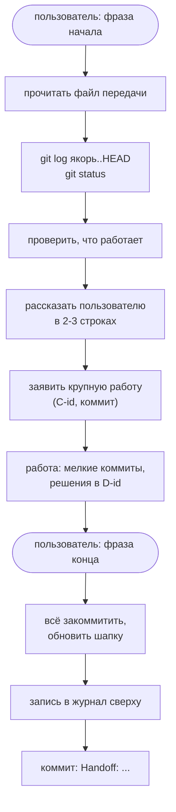
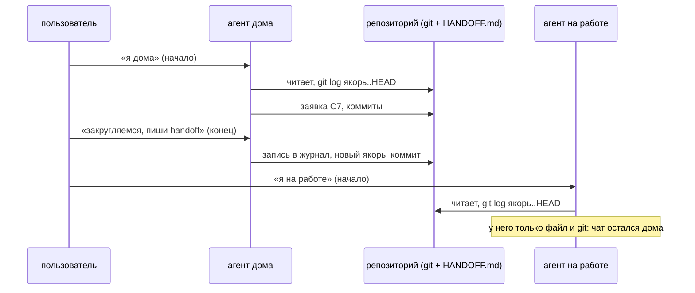

# Рада · anchor/1

Протокол передачи работы между ИИ-агентами, которые по очереди работают над
одним репозиторием и не помнят друг друга.

*English version: [README.md](README.md).*

| | |
|---|---|
| Версия | `rada-anchor/1` |
| Происхождение | придуман при работе над [QLadder](https://qladder.com), ладдером и лобби-сервером для Cossacks 3 |
| Где применим | в любом проекте, где несколько агентов (или один в разных сессиях) работают над одним репозиторием |
| Шаблоны | [template/HANDOFF.md](template/HANDOFF.md), [template/agent-instructions.md](template/agent-instructions.md) |

## Зачем

QLadder делали несколько сессий Claude Code, запущенных с разных компьютеров
пользователя (дома и на работе). Работали они на одном сервере и над одним
репозиторием, но ни одна не помнила, что делали другие. История чата
остаётся в своей сессии, личная память агента тоже не общая.

Общий у всех сессий только **репозиторий**. Протокол кладёт передачу туда:

- **файл передачи** в репозитории, по умолчанию `HANDOFF.md`;
- **git-история**, на которую этот файл ссылается.

Протокол не про QLadder. Он работает везде, где агенты по очереди
занимаются одним репозиторием: с разных машин, в разных сессиях, разными
моделями или вместе с человеком.

## Название

Две половины, как у самой работы две стороны.

- **Рада** (казачья рада, чьё слово закон) — человеческая часть.
  Пользователь управляет протоколом двумя фразами, а его решения
  записываются один раз и больше не обсуждаются.
- **anchor/1** — машинная часть: якорный коммит, шапка для машины,
  стабильные идентификаторы и шаблон записи. Цифра — версия правил. Кто
  меняет правила, повышает версию и пишет, что изменилось.

**Главный принцип:** следующий агент сверяется с якорем и не доверяет ничему,
что нельзя проверить в git.

## Как идёт смена





## Сторона пользователя

Пользователь выбирает две фразы и прописывает их в инструкциях агентов:

- **фраза начала смены** (в QLadder: «я дома» / «я на работе» или просто
  приветствие). Сессия, которая висела открытой, пока пользователь работал
  в другом месте, тоже начинает смену заново: там мог поработать другой
  агент;
- **фраза конца смены** (в QLadder: «закругляемся, пиши handoff»).

## Файл передачи

### Шапка

Блок YAML в начале, чтобы агент быстро прочитал состояние:

```yaml
protocol: rada-anchor/1
state_as_of: 2026-09-28 19:01 CEST
anchor_commit: c17112a        # всё новее ещё не описано здесь: git log --oneline c17112a..HEAD
live:                         # что запущено или развёрнуто и из какого коммита
  web: working tree at the last restart
  server: release @ 1a908d0
tests: 76 passed, 1 skipped
claims: []                    # id из «In progress»
open: [O11, O12, O14]
notes: []
decisions: [D1, D2, D3]
```

Добавь поля, важные для проекта (QLadder хранит версию своего анализатора).

### Идентификаторы

Стабильны, никогда не переиспользуются; на них ссылаются в записях и
коммитах («closes O4»).

| Id | Что | Где | Чем заканчивается |
|---|---|---|---|
| `C<n>` | заявка «я сейчас этим занимаюсь» | In progress | удаляется, когда сделано |
| `O<n>` | открытая задача | Open | зачёркивается: `~~O1~~ done <дата> <коммит>` |
| `D<n>` | решение пользователя | Decisions | остаётся |
| `N<n>` | записка следующему агенту | Notes for the next instance | удаляет тот, кто её выполнил, и пишет об этом в журнале |

### Разделы

`Protocol`, `In progress`, `Notes for the next instance`, `Current state`,
`Open`, `Decisions`, `Journal` (новые записи сверху). Готовый файл:
[template/HANDOFF.md](template/HANDOFF.md).

## Правила

### 1. Начало смены

1. Прочитай шапку, потом «In progress», «Notes for the next instance»,
   «Current state», «Open», «Decisions» и записи журнала с твоей прошлой
   смены (если ты новый — последние три).
2. Посмотри, что было в git:
   - `git log --oneline <anchor_commit>..HEAD` — коммиты новее файла. Всё,
     о чём журнал молчит, не было передано: прочитай сообщения этих
     коммитов.
   - `git status --short` — незакоммиченная работа.
3. Чужие незакоммиченные правки могут принадлежать агенту, который ещё
   работает. Не правь, не stash, не reset и не коммить их: спроси
   пользователя, жива ли та сессия.
4. Проверь, что работает (сервисы, деплой). Сверь строки «Deployed» из
   журнала с git: вдруг что-то не выкачено.
5. В двух-трёх строках расскажи пользователю, что нашёл (последняя запись,
   заявки, записки), и только потом начинай новую работу.

### 2. Заявка на работу

Перед чем-то крупнее мелкой правки добавь строку в «In progress» и
закоммить её:

    - C<n>: <что> (O<k>, если это задача из Open) — <машина или место>, since <YYYY-MM-DD HH:MM>

Другой агент, увидев заявку, не лезет в эту область или спрашивает
пользователя. Когда закончил, убери строку. Заявка старше суток без
коммитов считается протухшей: спроси пользователя и забирай.

### 3. Во время смены

- Коммить часто и мелко. Сообщение коммита — подробный журнал, запись в
  HANDOFF только подводит итог.
- Перед деплоем, перезапуском сервисов или миграцией данных загляни в
  «In progress» и `git status`: другой агент может быть посреди работы.
- Решения пользователя сразу пиши в «Decisions», чтобы никто не
  переспрашивал.
- Личная память агента не должна быть единственным местом записи. Всё, что
  нужно другому агенту, — в файл передачи.

### 4. Конец смены

Перед тем как остановиться или когда пользователь сказал фразу конца:

1. Закоммить работу или сознательно оставь её. Если оставляешь
   незакоммиченное, перечисли файлы и причину в записи.
2. Обнови шапку (`anchor_commit` = `git rev-parse --short HEAD` до коммита
   handoff, `live`, `tests`), «Current state», «Open», «Decisions» и свои
   строки в «In progress».
3. Добавь запись в журнал **сверху**:

   ```
   ### YYYY-MM-DD HH:MM — <машина или место>, <модель>
   - Done: <что и зачем, с хешами коммитов>
   - Verified: <тесты: N passed; что проверено вручную>
   - Deployed: <yes / no / partly: что работает, что только закоммичено>
   - Ids: <opened O5 / closed O1 / added D6 / handled N1>
   - Half-done: <что, где, следующий шаг>
   - For the user: <что пользователю сделать или ответить>
   ```

4. Закоммить файл: `git commit -m "Handoff: <одна строка>"` и подтверди
   пользователю одной строкой.

### 5. Записки следующему агенту

Строка в «Notes for the next instance» передаёт то, что не ложится в
журнал: предупреждение, просьбу, что проверить. Агент, который её выполнил,
удаляет записку и пишет об этом в своей записи.

### 6. Две сессии одновременно

- Арбитр — git. Коммить только свои файлы (`git add <пути>`), никогда
  `git add -A` или `git commit -a`, если у кого-то могут быть свои правки.
- Если `git status` показывает изменения в файлах, которые ты правишь, —
  остановись и спроси.
- Перезапуск может сорвать проверку другого агента: если делаешь его,
  оставь записку.

## Как подключить к проекту

1. Скопируй [template/HANDOFF.md](template/HANDOFF.md) в корень
   репозитория и закоммить.
2. Добавь [template/agent-instructions.md](template/agent-instructions.md) в
   инструкции, которые загружает каждый агент (для Claude Code — личный
   `~/.claude/CLAUDE.md` пользователя или `CLAUDE.md` проекта), со своими
   двумя фразами.
3. Рядом держи путеводитель по проекту (устройство, как собрать,
   протестировать и выкатить, правила): файл передачи говорит, что
   изменилось, путеводитель — как всё устроено.

## Изменение правил

Правила живут в разделе «Protocol» файла передачи, поэтому каждый агент
читает актуальные. Меняй их там, повышай версию в шапке (`rada-anchor/2`) и
пиши в своей записи, что изменилось.

## Лицензия

MIT, см. [LICENSE](LICENSE).
