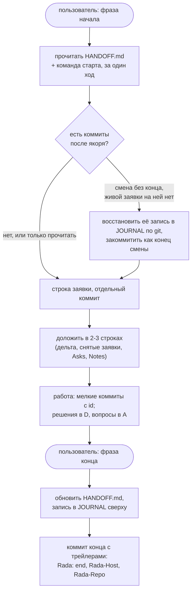

# Рада · anchor

**rada-anchor** — встроенный в репозиторий протокол передачи работы для
ИИ-агентов, которые пишут код и по очереди работают над одним
репозиторием. Текущее состояние хранит
небольшой файл передачи, а коммит-якорь в git отмечает, что уже передано.

*English version: [README.md](README.md).*

| | |
|---|---|
| Версия | `rada-anchor/2` (v1: тег [`v1`](../../tree/v1)) |
| Происхождение | придуман при работе над [QLadder](https://qladder.com), ладдером и лобби-сервером для Cossacks 3 |
| Где применим | несколько агентов, или один агент в нескольких сессиях, над одним репозиторием |
| Правила | [RULES.md](RULES.md): карточка, которую загружает каждая сессия (на английском) |
| Шаблоны | [template/HANDOFF.md](template/HANDOFF.md), [template/JOURNAL.md](template/JOURNAL.md), [template/agent-instructions.md](template/agent-instructions.md) |
| Инструмент (по желанию) | [tools/rada-status](tools/rada-status) |

## Зачем

QLadder делали несколько сессий Claude Code, запущенных с разных
компьютеров пользователя (дома и на работе). Работали они на одном сервере
и над одним репозиторием, но ни одна не помнила, что делали другие. История
чата остаётся в своей сессии, личная память агента тоже не общая.

Общий у всех сессий — **репозиторий**. Поэтому протокол кладёт
передачу туда: файл передачи с текущим состоянием и git-историю, на которую
он ссылается.

Протокол не про QLadder. Он работает везде, где агенты по очереди
занимаются одним репозиторием: с разных машин, в разных сессиях, разными
моделями или вместе с человеком.

## Название

Две половины, как и у работы две стороны.

- **Рада** — человеческая половина, по имени казацкого совета, чьё слово
  твёрдо. Пользователь управляет протоколом двумя фразами: начала и конца
  смены. Его решения записываются один раз, и их больше не переспрашивают.
- **anchor** (якорь) — машинная половина: коммит в git, который отмечает,
  где кончается передача. Следующий читатель начинает от якоря и не верит
  ничему, что нельзя проверить в git.

## Что меняет v2 и почему

Версия 1 писалась для чтения людьми: в одном файле лежали и правила, и
состояние, и журнал. Спустя пять дней работы над QLadder замеры на его
настоящем `HANDOFF.md` в последней передаче по v1 (71 правка, 7 смен, 2
компьютера) показали:

- **Цена старта росла с возрастом проекта, а не с объёмом открытой
  работы.**
  - Файл занимал около 33 000 символов (около 9 500 токенов) и читался
    целиком на каждом старте. Каждый день он прибавлял примерно 1 500
    токенов.
  - Агенту из него было нужно около 1 000 токенов.
  - Раздел правил (около 1 200 токенов) не менялся после первого часа, а
    перечитывался 66 раз.
  - Закрытые пункты занимали 1 350 токенов, журнал — 3 700.
- **Слабым местом был ритуал конца смены.**
  - 2 смены из 7 закончились без передачи, и следующий агент
    восстанавливал запись по git. Обе те сессии были живы, просто
    простаивали.
  - Хэш якоря писали руками, и за 71 правку он принял всего 6 значений.
  - Устаревали и другие значения, переписанные руками: число тестов,
    версии, даты.
- **Открытые пункты превратились в дневники.** Один разросся до 2 400
  символов хроники, и часть его фраз успела стать неправдой.
- **Заявки ни разу не пересеклись, зато протухали.** 20 из 57
  handoff-коммитов были чистой бухгалтерией (заявки, начала смен).
- **Коммиты в других репозиториях проекта** якорь не видел.

Поэтому v2:

1. **Выносит правила из файла состояния.** Карточка [RULES.md](RULES.md)
   загружается вместе с инструкциями агента и закреплена за тегом релиза
   этого репозитория. В Claude Code её импортирует `~/.claude/CLAUDE.md`.
2. **Вычисляет якорь**, а не хранит его. Якорь — самый новый коммит с
   трейлером `Rada: end`. Если смена закончилась без него, следующий агент
   видит всю эту смену после старого якоря, то есть ровно то, что ему и
   надо разобрать. Он восстанавливает запись, и её коммит становится новым
   якорем.
3. **Держит файл передачи горячим и маленьким.**
   - Каждая запись — одна строка; её переписывают на месте и удаляют,
     когда она закрыта.
   - Весь файл укладывается в 8 000 символов.
   - История уходит в сообщения коммитов и `JOURNAL.md`, который на
     старте никто не читает.
4. **Добавляет Asks** — список того, что ждёт пользователя. Раньше такое
   терялось в журнале.
5. **Записывает головы других репозиториев** в коммит конца смены
   (трейлеры `Rada-Repo`), чтобы следующий агент видел и их коммиты.
6. **Пишет только то, что нельзя вычислить**, вместе с коммитом или датой,
   когда это было замечено.

Когда QLadder перешёл на v2, его файл передачи сжался примерно с 34 000
до 5 000 символов при той же открытой работе. Дальше он растёт вместе с
открытой работой, а не с возрастом.

### Чего в v2 нет

Перед v2 ещё несколько предложений сверили с историей QLadder, и каждое
отклонено по своей причине:

- **Папка файлов состояния, журнал записей в JSONL, JSON-схема.** Каждый
  лишний файл — ещё один вызов инструмента на старте. Агенты правят файлы
  точной заменой строк, а длинные JSON-строки с экранированием так править
  труднее всего.
- **Обязательная утилита командной строки.** Её надо ставить, держать в
  ногу со спецификацией, и на новой машине её может не оказаться.
  `tools/rada-status` — по желанию.
- **Заявки с масками путей, граф зависимостей.** Они решают проблемы,
  которых не было. Пересечений заявок не случалось, протухание — да. При
  нескольких открытых пунктах хватает одного слова `blocked:`.
- **Базы данных, эмбеддинги, демоны.** Весь смысл в том, что хватает git и
  текстового файла.

Черновик v2 потом проверили агенты, отыграв его на тестовых репозиториях.
Из этой проверки пришли точная команда коммита конца смены, восстановленная
смена как отдельный коммит конца, «жадный» `next_ids` и правила для общей
рабочей папки.

## Как идёт смена



## Файл передачи

`HANDOFF.md` хранит текущее состояние и больше ничего. Его читают на
каждом старте, и он укладывается в 8 000 символов (`wc -m`). Разделы, по
порядку:

| Раздел | Что в нём |
|---|---|
| Profile | id хостов, ветка, языки, другие репозитории |
| Live | YAML-блок: что работает и с какого коммита, тесты с коммитом прогона, `next_ids` |
| Claims | строки `C`, по одной на сессию |
| Asks | строки `A`: что может сделать или ответить только пользователь |
| Notes | строки `N`: предупреждения о текущем состоянии, у каждого — чем оно кончится |
| Open | строки `O`: открытая работа, её состояние и следующий шаг |
| Decisions | строки `D`: действующие решения пользователя |

Запись — одна строка, не длиннее 300 символов:

```
- C12 · home/1a2b3c4d · 2026-09-29T18:24+02:00 · the draw page (O7) · holds: web
- O7 · tournament draw · live on the demo · next: seeded pots · blocked: A2
- D4 · Sign-in with Steam only · 2026-09-24
- A2 · Pick the seeding rule for the draw · since 2026-09-29 (O7)
- N3 · The demo database is mid-migration: do not restart demo · until O7 is deployed
```

- **Id никогда не переиспользуются.** В `next_ids` лежит следующий
  свободный номер каждого типа. Агент берёт номер и поднимает счётчик той
  же правкой, так что смена, оборвавшаяся на полпути, никогда не оставит
  `next_ids` указывающим на уже занятый id.
- **Закрытые записи удаляются.** Их история — в git
  (`git log --grep='\<O7\>'`) и в `JOURNAL.md`.
- **Решения уходят из файла**, когда пользователь их заменяет или
  отменяет, или когда они становятся просто фактами о проекте и переезжают
  в руководство.
- **Заявка называет свою сессию**: id хоста и, если у агента есть id
  сессии, его первые 8 символов. Так две сессии на одном компьютере не
  спутать.
- **Id хостов — только ASCII** (`home`, `work`). В Profile записано, как
  пользователь называет эти компьютеры.

Готовый файл: [template/HANDOFF.md](template/HANDOFF.md).

## Журнал

`JOURNAL.md` хранит по записи на смену, новые сверху. Это журнал аудита:
агенты читают его, когда нужно понять «почему». На старте читают только
его верх, и только чтобы положить туда восстановленную запись. В заголовке
записи — диапазон коммитов, который она покрывает:

```
## 2026-09-29T22:10+02:00 · home · 5480caf..a1b2c3d
- done: tournaments phase 6: the bot announces a series (O15; 1234abc, 5678def)
- verified: tests: 170 passed @a1b2c3d; the notice in a live room
- deployed: web @a1b2c3d; server unchanged
- ids: -O15 +A4 -C24
- left: nothing
```

Три вида заголовков:

```
## <time> · <host> · <anchor>..<last work commit>                      a normal shift
## <time of its last commit> · <its host, or ?> · <range> · reconstructed   a shift rebuilt from git
## <time> · <host> · adopted at <HEAD>                                   adoption, or a move from v1
```

То есть обычная смена, смена, восстановленная по git, и внедрение или
переход с v1.

## Якорь

Коммит конца смены коммитит `HANDOFF.md` и `JOURNAL.md` вместе. Его
сообщение заканчивается одним блоком трейлеров:

```
Handoff: tournaments phase 6

Co-Authored-By: Claude <noreply@anthropic.com>
Rada: end
Rada-Host: home
Rada-Repo: 34c1ef5a90b1 ~/server
Rada-Repo: 7bc4ea3c02d4 ~/spec
```

- **Трейлеры пишутся через `git commit --trailer`.** Git читает трейлеры
  только из последнего абзаца сообщения. Пустая строка перед
  `Co-Authored-By` или строка обычного текста внутри блока молча прячут
  `Rada: end`, и смена выглядит непереданной. `--trailer` дописывает в уже
  существующий блок.
  - Проверка: `git log -1 --format='%(trailers:key=Rada,valueonly)'`
    печатает `end`.
- **Якорь** — самый новый коммит на ветке из Profile, в трейлерах
  которого есть `Rada: end`. Эталонная реализация — `tools/rada-status`;
  вручную:

  ```
  git log --format='%h %(trailers:key=Rada,valueonly)' | awk 'tolower($2)=="end"{print $1; exit}'
  ```

  Коммит, который только цитирует эту строку в теле, не считается.
- **Дельта** — `git log <anchor>..HEAD`, читать с полными сообщениями:
  id в телах коммитов тоже считаются. Каждый коммит в ней для читателя
  новый, служебные тоже.
- **Другие репозитории** получают по трейлеру
  `Rada-Repo: <12-character HEAD> <path>`, и их дельта —
  `git -C <path> log <hash>..HEAD`. Путь абсолютный или начинается с `~/`,
  в нём могут быть пробелы.
- **Коммит конца смены нельзя исправлять через amend или squash.** Amend с
  новым сообщением теряет трейлеры. Squash-слияние хоронит их в общем
  сообщении. Пул-реквесты сливайте через rebase. Ошибочный коммит конца
  исправляется новым коммитом конца.
- **Трейлеры живут только в репозитории с файлом передачи.** В публичных
  репозиториях в сообщениях коммитов — самое большее id.

## Правила

Нормативный текст — [RULES.md](RULES.md): девять инвариантов, записи и
когда каждую удалять, заголовки журнала, шаги внедрения, начала, работы и
конца. Коротко:

- **Начало:**
  - прочитать `HANDOFF.md` и выполнить команду старта за один ход;
  - не трогать файл передачи, который правит другая сессия;
  - снять заявки других сессий, если в дереве нет изменений, сделанных не
    тобой, и назвать их в докладе;
  - разобрать дельту, а пропущенную смену восстановить отдельным коммитом
    конца, если её не покрывает заявка, которая может быть живой;
  - заявиться;
  - доложить в двух-трёх строках.
- **Работа:**
  - мелкие коммиты по файлам, с id в сообщениях;
  - каждую правку файла передачи коммитить сразу;
  - решения пользователя становятся строками D, вопросы к нему — строками
    A;
  - никаких перезапусков, пока в дереве чужие изменения или на ресурсе
    живая заявка;
  - никаких amend, rebase и reset.
- **Конец:**
  - ещё раз выполнить команду старта: вдруг кто-то уже сдал смену;
  - обновить состояние;
  - добавить запись в журнал сверху;
  - сделать коммит конца через `--trailer` и проверить его;
  - подтвердить одной строкой.

## Две сессии одновременно

Заявка — вежливость, а не замок. От вреда защищает RA-7: не трогать
изменения, которые сделал не ты. Протокол работает в двух вариантах.

**Одна общая рабочая папка** (один сервер, один пользователь, как в
QLadder). Обе сессии видят незакоммиченные изменения друг друга и делят
индекс git.

- `git commit -- <files>` коммитит только эти файлы, что бы ни
  подготовила к коммиту другая сессия.
- Но он берёт всё содержимое каждого файла из рабочей папки, включая
  правки другой сессии в том же файле. Поэтому сначала —
  `git diff HEAD -- <files>`. Поэтому же файл передачи коммитят после
  каждой правки и никогда не оставляют грязным.
- Новый файл добавляют и коммитят одной командой, чтобы он не ждал в общем
  индексе.
- Никаких amend, rebase и reset: HEAD может оказаться коммитом другой
  сессии.
- Никогда не удалять `.git/index.lock`: он значит, что другая сессия
  сейчас работает с git.
- Перезапуск выкатывает рабочую папку, поэтому сначала проверить
  `git status` на чужие изменения.

**Отдельные клоны**, где решают пуши:

- `git pull --rebase` перед чтением и перед правкой файла передачи.
- После каждого коммита заявки и коммита конца — снова
  `git pull --rebase`, потом push.
- Держать историю линейной.
- В `.gitattributes` добавить `JOURNAL.md merge=union`.
- После rebase сверить `next_ids` с id в файле и в сообщениях новых
  коммитов.

## Как внедрить

1. Скопировать [template/HANDOFF.md](template/HANDOFF.md) и
   [template/JOURNAL.md](template/JOURNAL.md) в корень репозитория.
   Заполнить Profile и выставить `next_ids` на единицу выше занятых id.
2. Развернуть тег релиза этого репозитория отдельной копией (git
   worktree), например в `~/.rada/v2`.
   Добавить строки из
   [template/agent-instructions.md](template/agent-instructions.md) в
   инструкции, которые каждая сессия загружает сама. В этом файле сказано,
   куда их класть и как проверить, что карточка загрузилась.
3. Держать рядом руководство по проекту (устройство, сборка, тесты,
   выкладка, долговечные факты). Файл передачи говорит, что происходит;
   руководство — как всё устроено.
4. Сделать первый коммит конца смены (RULES.md, Adopt). Он станет первым
   якорем.

Нужен git 2.32 или новее, ради `git commit --trailer`.

### Переход с v1

1. Вынести долговечные факты из `HANDOFF.md` в руководство или документы:
   «Current state» и знания, закопанные в длинных пунктах Open.
2. Перенести журнал в `JOURNAL.md` как есть.
3. Переписать записи в одну строку:
   - выбросить закрытые пункты;
   - выставить `next_ids` на единицу выше самых больших занятых id;
   - ещё не сделанные строки «For the user» превратить в Asks.
4. Удалить раздел Protocol и поля заголовка, которые вели руками
   (`anchor_commit`, `state_as_of`, списки id), и добавить Profile.
5. Заменить строки v1 в инструкциях агентов на строки v2.
6. Сделать переходный коммит одновременно передачей по v1 и коммитом конца
   по v2: запись в журнале с заголовком «adopted» о смене правил плюс
   трейлеры `Rada: end`. `JOURNAL.md` новый, поэтому `git add` его в той же
   команде.

## Как менять правила

Карточка версионируется в этом репозитории, релизы — теги (`v1`, `v2`).
Проект называет версию, по которой живёт, в заголовке своего `HANDOFF.md`,
а его агенты импортируют карточку из копии этого тега. Кто меняет правила,
поднимает версию, ставит тег, передвигает эту копию и пишет, что
изменилось, в записи журнала.

## Лицензия

MIT, см. [LICENSE](LICENSE).
